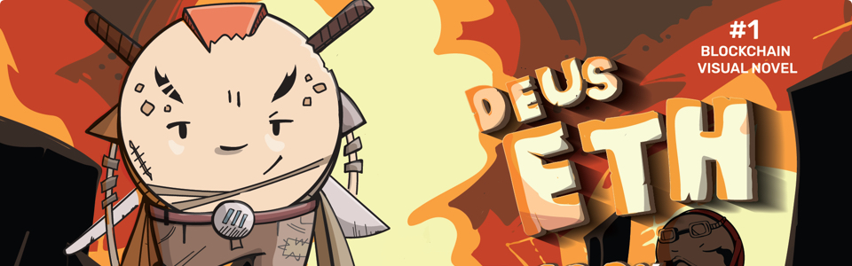
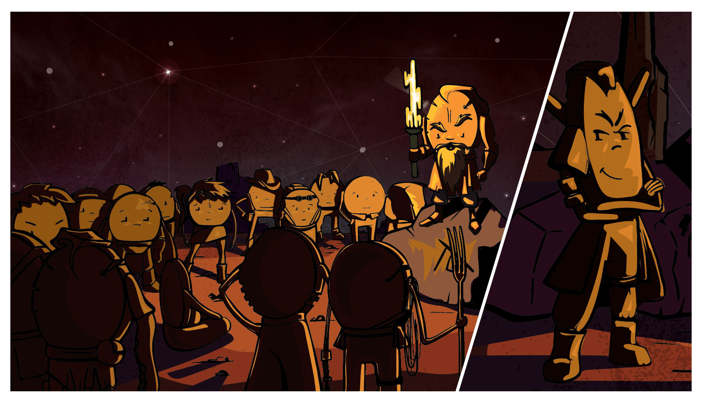
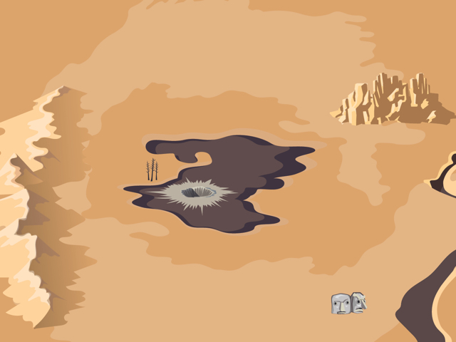

# DeusETH

**A Crypto-Theatre in Ten Acts**
Ethereum Mainnet · Generative Narrative · Smart Contract · 2018

> *Always for some. But never for all.*



---

## What Is This

DeusETH is a crypto-theatre artwork created in 2018. Fifty token-characters were deployed on the Ethereum blockchain and governed by a Park-Miller pseudo-random number generator seeded from a committed block hash. Across ten episodes broadcast between March and April 2018, forty-seven of them died on-chain. Three survived: **Harold (#5)**, **Danko (#10)**, and **Lucy (#11)**.

The deaths were not authored. They were executed by a smart contract — the god of this world. The team built narrative around algorithmic fate, but the outcomes were determined by code running against entropy. In the contract's storage, `state = 1` still holds for the three surviving token IDs. They are, in the strictest technical sense, alive.

This website is the **2026 retrospective exhibition** — a curatorial frame that presents DeusETH as a completed historical artefact. It is not a reconstruction or a sequel. The show ended in 2018. The chain is the primary record; this site is the museum.

**Live:** [deuseth.art](https://deuseth.art)

## The Show (2018)

| # | Episode | Date | Deaths |
|---|---------|------|--------|
| 0 | Prologue | 2018-03-14 | — |
| I | Bloody Kitties | 2018-03-16 | 3 |
| II | Wolf Party | 2018-03-20 | 7 |
| III | Freedom to Die | 2018-03-23 | 5 |
| IV | Redrum | 2018-03-26 | 1 |
| V | Murder | 2018-03-28 | 5 |
| VI | The Final Battle | 2018-03-30 | 5 |
| VII | Scam | 2018-04-03 | 5 |
| VIII | Hard Fork | 2018-04-06 | 9 |
| IX | Tokencide | 2018-04-10 | 5 |
| X | Tokenville | 2018-04-13 | 2 |

50 tokens entered. 47 died. 3 remain on-chain with `state = 1`.



## The World



The story takes place in the Orphant Lands — a wasteland governed by a force the characters call the Creator. Fifty tokens are divided into three tribes (Survival, Humanity, Order), each with its own philosophy on how to endure algorithmic fate. The map, the lore, and the tribes are accessible on the site's [Lore page](https://deuseth.art/lore).

## Tech Stack

- **React 19** + **Vite 8** — no TypeScript, plain JSX
- **React Router DOM 7** — client-side routing with modal overlay pattern
- **react-slick** — episode carousels
- **use-sound** — audio playback (death/revival/winner sound effects)
- **lucide-react** — icons
- **classnames** — conditional CSS class composition
- **Deployed on:** Vercel + Cloudflare Workers

## Getting Started

```bash
# Prerequisites: Node.js 20+, npm

# Install dependencies
npm install

# Start development server
npm run dev

# Production build
npm run build

# Preview production build locally
npm run preview

# Lint
npm run lint
```

## Project Structure

```
src/
  pages/              Route-level views
    Adventures.jsx       Main episode player (default route)
    Statement.jsx        Museum wall text (modal overlay)
    History.jsx          Blockchain timeline (modal overlay)
    Lore.jsx             Worldbuilding & tribes (modal overlay)

  components/          27 reusable components
    Episode.jsx            Single episode view (video/carousel/image)
    EpisodeList.jsx        Episode slider on the main page
    EpisodeMedia.jsx       Media renderer (video, carousel, static image)
    CharacterList.jsx      Character grid with alive/dead states
    CharacterModal.jsx     Character detail popup
    StageScene.jsx         Tokenville finale stage
    TeamChat.jsx           Episode X in-world chat log
    VideoSubtitles.jsx     Synced subtitle overlay
    ...

  hooks/
    useCharacterStatuses.js   Single source of truth for character state

  utils/               Helpers (audio player factory, etc.)
  styles/              Per-component CSS files + App.css (variables, globals)
  data/                Static JSON data
    characters.json      50 canonical characters (id, name, bio, tribe, sale data)
    stories/             Character stories (Draft.js editor format)
    obits/               Character obituaries indexed by episode

public/
  data/episodes/       Episode configs (events, media, art paths)
  images/              Character art, episode art, backgrounds
  sounds/              Audio files (buzzer, reborn, winner)
```

## Routing

| Path | View |
|------|------|
| `/` | Redirects to `/adventures` |
| `/adventures` | Episode list (slider) |
| `/adventures/:episode` | Episode player |
| `/adventures/:episode/story/:heroId` | Character story |
| `/adventures/:episode/obit/:heroId` | Character obituary |
| `/statement` | Wall text — curatorial statement |
| `/history` | Blockchain timeline — on-chain evidence |
| `/lore` | Worldbuilding — tribes, lands, mythology |

Statement, History, and Lore open as full-screen overlays on top of Adventures via React Router location state. Close with Escape or click outside.

## Architecture

### Character State Machine

Characters transition through states driven by episode event data:

```
alive → dying → dying-settled (3.2s) → dead
dead → reviving → alive
```

The `useCharacterStatuses()` hook is the single source of truth.

### Event-Driven Deaths

Each episode JSON defines an `events` array. Events trigger based on:

- **No trigger** — fires on episode load
- **`at.videoTime`** — fires at a video timestamp
- **`at.slide`** — fires at a carousel slide index

Actions: `die`, `revive`, `highlight`, `winner`.

### Modal Layer

Statement, History, and Lore are overlay pages. Adventures stays mounted underneath as a backdrop, preserving scroll position and episode state.

### Styling

- Per-component CSS files in `src/styles/`
- CSS custom properties defined in `App.css`
- Fonts: Alegreya (serif body), Alegreya Sans (sans-serif UI)
- Mobile-first responsive design (`@media max-width: 600px`)
- Death/revival CSS animations with IntersectionObserver fade-ins

## Timeline

- **2018** — Original artwork created and performed on Ethereum mainnet
- **2026** — Retrospective exhibition site built as a curatorial archive

## License

This is an art project. The code in this repository serves the exhibition.
